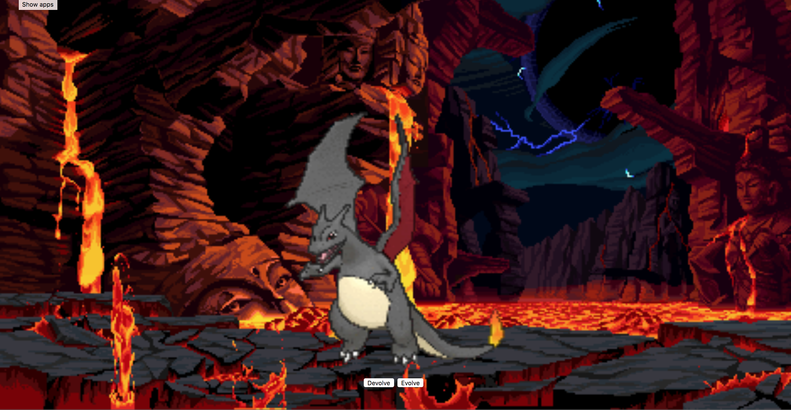

# Reign of Fire
This project is meant to cycle through arrays using images and keypad directionals.

**Link to project:** https://amazing-benz-93ef58.netlify.com/

## How It's Made:

**Tech used:** HTML, CSS, & JavaScript

This was one of my favorite projects because I got to show off the beautiful evolution line of my favorite pokemon. Clicking the "Evolve" button evolves the current stage of charmander into the next and the "Devolve" button devolves the current stage back one step. This was a perfect way to display how arrays work and how they can be cycled through.

## Optimizations

I added the button directionals to this project which turned out to be way more comfortable and clean-cut for this project.

## Lessons Learned:

I learned how to throw directionals on about anything with this project and also how to edge case.

## Examples:
Take a look at these couple examples that I have in my own portfolio:

**To-Do List:** https://github.com/alecortega/palettable

**Teacher Attendance List:** https://github.com/alecortega/twitter-battle

**Slot Machine:** https://github.com/alecortega/patch-panel
